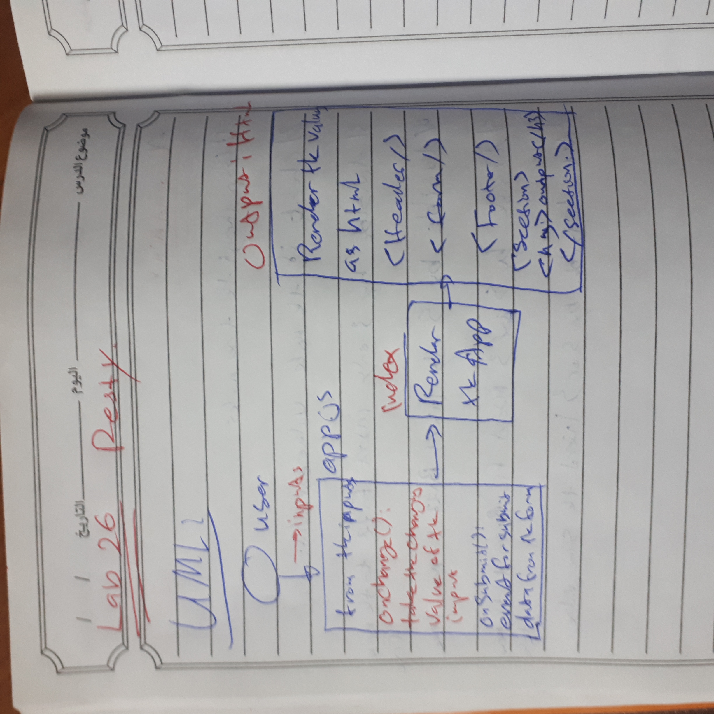

# lAB - Class 26

## Project : RESTy

### Author : Ahmad AlHabrawi 

## Setup
* .env requirements (where applicable)
* i.e.
 * PORT - Port Number
 * MONGODB_URI - URL to the running mongo instance/db
### How to initialize/run your application (where applicable)
 * e.g. npm start
### How to use your library (where applicable)
#### Tests
* How do you run tests?
* Any tests of note?
* Describe any tests that you did not complete, skipped, etc
## UML

